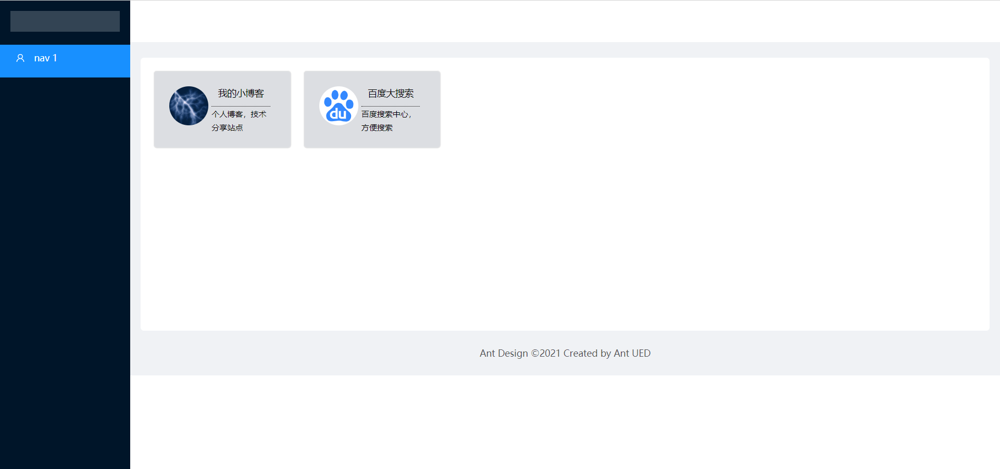
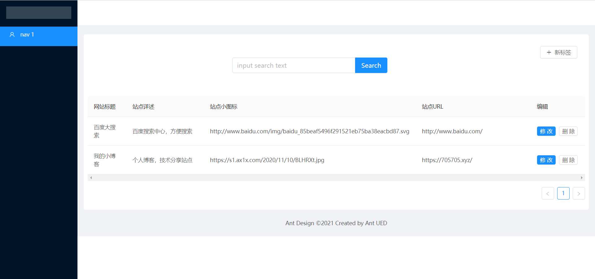
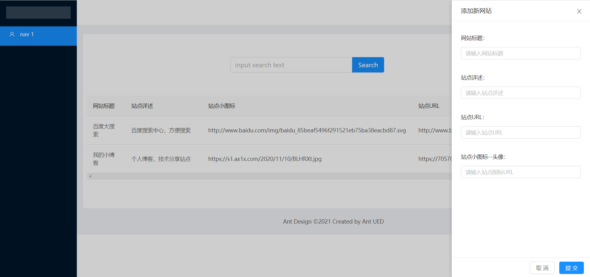

# 一个小导航站分享及思路分享

> 突发奇想，想要写个网页程序，放置一些自己觉得好玩的网页链接。姑且认为是在线的浏览器标签栏吧

使用的技术涉及到 Vue.js 以及 数据网络请求等相关知识。

主要使用技术如图：

1. Ant Design of Vue

   利用 Ant Design of Vue 优秀的UI模块，快速构建整个程序的框架以及小组件。

2. Vue.js

   渐进式 JavaScript 框架，不用多说，懂得自然秒懂

3. LeanCloud

   后端结构化数据存储，读取数据可直接使用axios进行操作

程序可以直接放置在支持html页面的空间内，数据存储在LeanCloud中。利用前后端分离的思想，将前端页面展示交给Vue.js,把后端数据处理依托于LeanCloud平台

可以把程序放在支持单页的空间,例如 GitHub、Gitee、coding、cloudflare 静态页面托管。

----

如需要本地搭建,需要获取LeanCloud密钥填写至  [js/config.js](./js/config.js) 相关内容,具体可看 [LeanCloud 文档](https://leancloud.cn/docs/leanstorage-started-js.html)

----

代码发出来,仅仅是抛砖引玉之意。如果单单说程序本身,还有很多需要完善之处,还望各位大佬指教.

程序 Demo ：http://add.705705.xyz/tags/

程序 Github: https://github.com/blueweiwei/fortags

